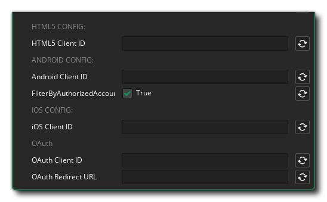

@title Setup

## Google Developer Console

### Creating Credentials

The Google Sign In extension requires you to provide the web client ID for the project the user is signing in to. To get this identifier you can follow the steps described in the Google Developer documentation here:

> [Create authorization credentials](https://developers.google.com/identity/protocols/oauth2/web-server#creatingcred)

[[Note: Creating the authorisation credentials is slightly different on the various platforms this extension is supported on. See the respective page under the **Access to Google APIs** section.]]

# GameMaker

## Extension Options

In the extension options you should first enter the client IDs for the different platforms on which your game will use the Google Sign In functionality.

> [!IMPORTANT]
> When entering the client ID into the extension options make sure you remove the extra `".apps.googleusecontent.com"` and only provide the UUID.

On Android, the option **FilterByAuthorizedAccounts** will check if the user has any accounts that have previously been used to sign in to your app. Users can choose between available accounts to sign in. See: https://developer.android.com/identity/sign-in/credential-manager-siwg#instantiate-google

If your game makes uses of the OAuth login functionality, you also need to enter the **OAuth Client ID** and the **OAuth Redirect URL**.

## Play App Signing

When testing your game on an attached Android device with [Play App Signing](https://support.google.com/googleplay/android-developer/answer/9842756) enabled, you may run into the error `10: Developer console is not set up correctly`. This can be solved by deploying the export to a release track and downloading the app from Google Play. This downloaded app will be signed with the correct keystore signature.